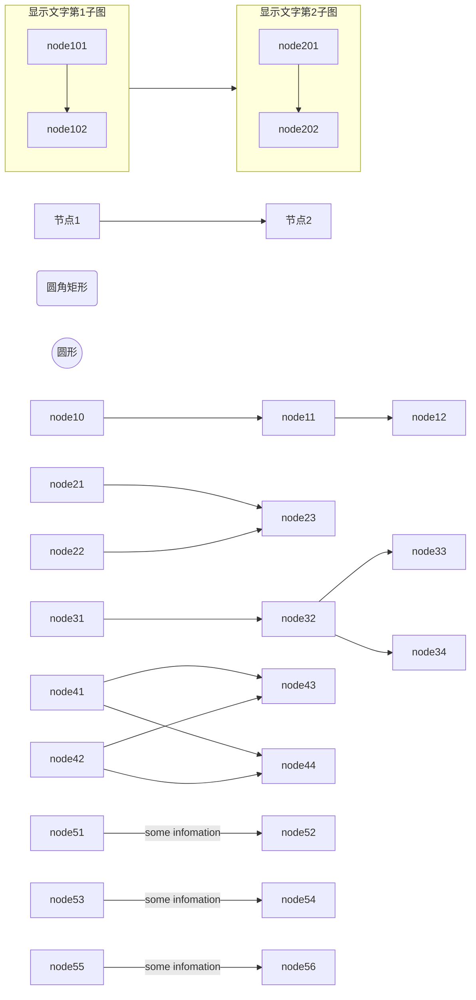
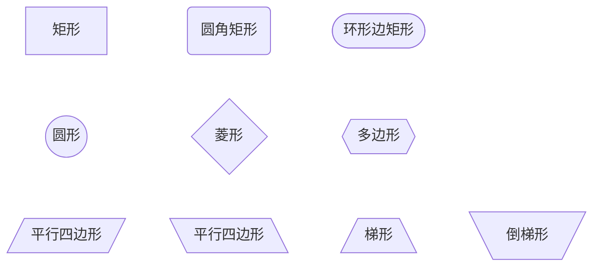
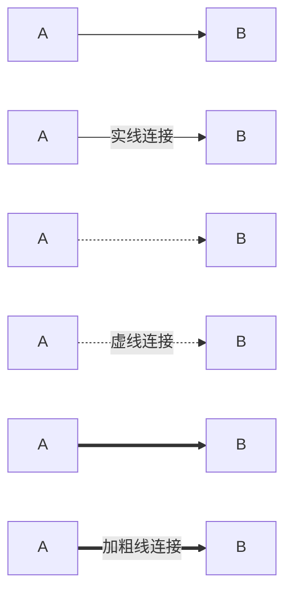
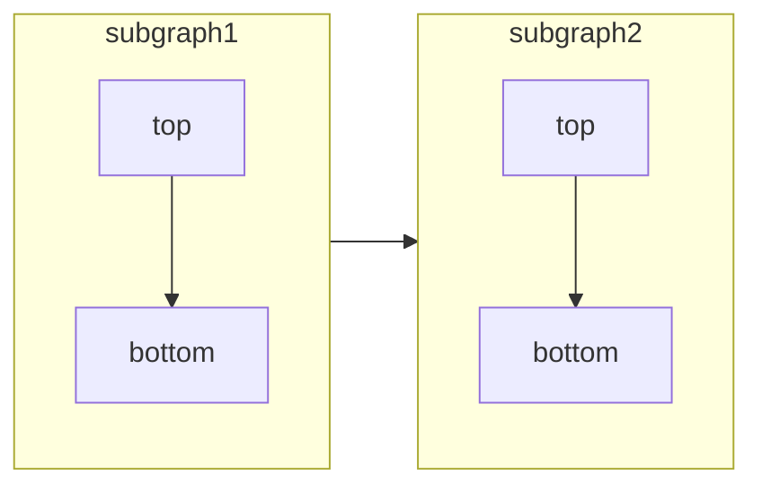
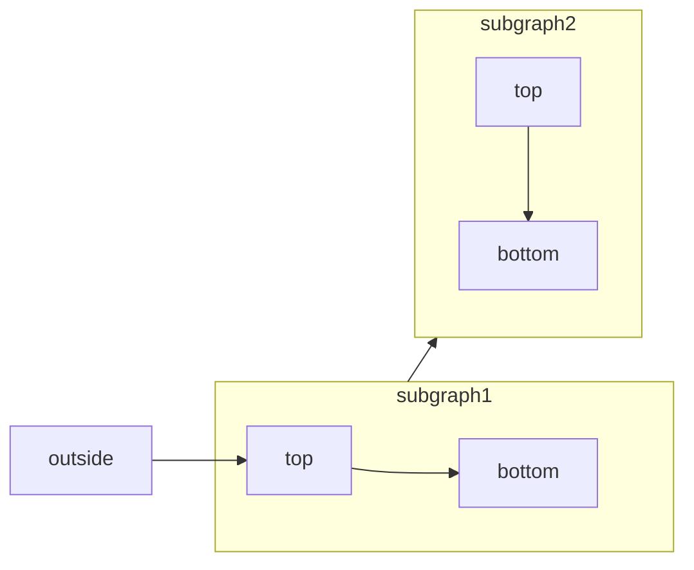
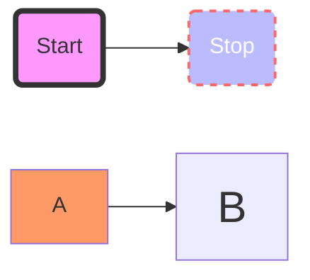

Mermaid是一门为绘制流程图设计的语言，只需输入简洁的代码，通过渲染就能生成流程图。相较于draw.io等绘图软件，在制作复杂流程图时更为高效，可以从各种错综复杂的节点和连线中解放出来。在实际的工作场景中，我发现Mermaid特别适合在熟悉工程作业上使用，在我接手他人工作，尤其大数据作业梳理数据流、表关系上下游时，用Mermaid做笔记可以更快掌握整个流程。

这篇文章对Mermaid主要语法进行归纳总结，这里只记录满足日常工作需要的流程图(即flowchart)的写法，没有包括其它像实体图等的写法，其它图类型写法可以参考[Mermaid官方文档](https://mermaid.js.org/intro/)。

<!--more-->

## 快速上手




## 更多设置项

### 节点图案与显示文字格式

node 节点支持多种显示样式，包括形状、显示文字样式、颜色等，这里只列举前两者的设置，颜色的修改留在 style 部分

常用节点样式写法如下：




节点内显示文字，支持通过markdown语法进行显示样式修改，一个简单的样例如下

```mermaid
node["`**加粗字体**`"]
```


### 连线样式

两个node之间连线的样式也同样支持修改，包括连线粗细，实线虚线，箭头样式等。




另外，连线的长短也可以进行设置，以调整节点具体分布，详情可以参考[https://mermaid.js.org/syntax/flowchart.html#minimum-length-of-a-link](https://mermaid.js.org/syntax/flowchart.html#minimum-length-of-a-link)


### 子图

子图的连接方向也是支持设置的，具体设置方法如下




在subgraph里层声明`direction`命令即可。

另外需要注意的是，如果有外部node连接到子图内部的node，direction的设置不会生效，会继承外部node的direction设置，例如将下图对比上图：




### style

Mermaid 还支持自定义css样式：具体设置如下




经过测试，声明的样式应该放置于节点图生成的命令后，否则可能样式不会生效。
